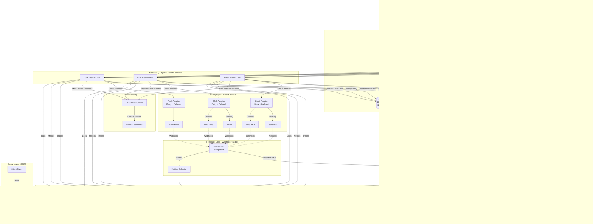

# Polyglot Notification System Design


[](https://github.com/UranusLin/notifications_design/actions)
[](https://github.com/UranusLin/notifications_design/blob/main/LICENSE)

This project is a reference implementation of a high-concurrency, multi-channel notification system, demonstrating best practices and design patterns for cloud-native microservice architectures across different programming languages (Java, Kotlin, Go, TypeScript, Rust).

## 1. Project Challenge & Requirements

This system is designed based on the following core requirements (from [`require.txt`](require.txt)):

### 1.1 Objective

Design and implement a notification delivery service that supports multiple channels (Email, SMS, Push) to send messages to end users.

### 1.2 Core API Endpoints

* `POST /notify`: Accept notification requests (channels, recipients, message) and enqueue for delivery.
* `GET /status/[notification_id]`: Query overall and per-channel delivery status.
* `GET /metrics`: Retrieve aggregated statistics (sent count, success count, failure count).
* `POST /webhook/callback`: Receive delivery receipts from external providers (e.g., [SendGrid](https://sendgrid.com/), [Twilio](https://www.twilio.com/)).

### 1.3 Key Constraints

1. **Multi-channel**: Support Email, SMS, Push. Handle different throughput, latency, and rate limits per channel.
2. **Multi-tenant**: Data isolation with tenant-level quota and rate limiting enforcement.
3. **High Scalability**: Handle burst traffic of **100k notifications/min** with low latency.
4. **High Reliability**:
   * **At-least-once delivery**: Ensure no message loss.
   * **Retry & Backoff**: Implement failure retry mechanisms.
   * **Idempotency**: Ensure idempotent retry and callback handling.
5. **Observability**: Complete tracing, metrics, and alerting.
6. **Extensibility**: Plugin architecture for easy addition of new channels (e.g., Voice, In-app).

---

## 2. System Architecture Design

This project demonstrates the evolution from a "portable reference implementation" to a "production-grade cloud-native architecture."

### 2.1 Current Implementation (Portable)

For demonstration and local development (Docker Compose), we use a simplified architecture:

* **API Gateway**: REST API (`POST /notify`) implemented in each language.
* **Message Queue**: Single Kafka Topic (`notifications`).
* **Workers**: Generic workers that consume messages and simulate delivery.
* **Storage**: PostgreSQL (state) + Redis (rate limiting).

### 2.2 Optimized Production Architecture

For massive scale (100k+ notifications/min) and multi-tenant scenarios, use the following optimized architecture:



#### Key Optimizations

##### 1. **Write Path Optimization**
- **Remove Synchronous DB Writes**: API layer only writes to Kafka, returns 202 Accepted, avoiding DB bottleneck
- **Dedicated State Writer**: Asynchronously consumes Kafka and batch writes to PostgreSQL for higher throughput
- **Idempotency Guarantee**: Uses Kafka offset + [Redis](https://redis.io/) deduplication for exactly-once semantics

##### 2. **Priority Queues**
- **High Priority**: OTP, security alerts (< 1s latency)
- **Normal Priority**: Transaction notifications, order confirmations (< 5s latency)
- **Low Priority**: Marketing emails, recommendations (< 30s latency)
- **Independent Scaling**: Each priority level's workers can scale independently based on queue depth

##### 3. **Channel Isolation**
- **Independent Worker Pools**: Email, SMS, Push deployed separately
- **Fault Isolation**: Single channel failure doesn't affect other channels
- **Independent Rate Limiting**: Each channel has its own Rate Limiter (Token Bucket)

##### 4. **Circuit Breaker & Fallback**
- **Circuit Breaker**: Uses [Hystrix](https://github.com/Netflix/Hystrix)/[Resilience4j](https://resilience4j.readme.io/) pattern, auto-breaks when external services fail
- **Multi-Provider Fallback**: Email uses [SendGrid](https://sendgrid.com/) primarily, auto-switches to [AWS SES](https://aws.amazon.com/ses/) on failure
- **Graceful Degradation**: Messages go to DLQ during circuit break, avoiding infinite retries

##### 5. **Failure Handling**
- **Exponential Backoff**: Retry intervals grow exponentially (1s, 2s, 4s, 8s, 16s)
- **Max Retry Limit**: Maximum 5 retries, then moves to DLQ
- **Dead Letter Queue**: Failed messages enter DLQ for manual or automated handling
- **Alerting**: Triggers alerts when DLQ depth exceeds threshold

##### 6. **CQRS Pattern**
- **Write Model**: API → Kafka → State Writer → PostgreSQL Master
- **Read Model**: Query API → PostgreSQL Read Replicas + [OpenSearch](https://opensearch.org/)
- **Eventual Consistency**: State updates have slight delay (< 100ms) but query performance is excellent

##### 7. **Full Observability**
- **Distributed Tracing**: [Jaeger](https://www.jaegertracing.io/) tracks complete lifecycle of each notification
- **Metrics**: [Prometheus](https://prometheus.io/) collects QPS, Latency, Error Rate, Queue Depth
- **Dashboards**: [Grafana](https://grafana.com/) provides real-time monitoring and alerting
- **Logging**: [ELK Stack](https://www.elastic.co/what-is/elk-stack) centralizes logs with full-text search and analysis
- **Alerting**: Multi-level alerting based on Prometheus AlertManager

##### 8. **Auto-scaling**
- **HPA (Horizontal Pod Autoscaler)**: Auto-scales based on CPU/Memory/Queue Depth
- **Kafka Partition Scaling**: Dynamically adjusts partition count based on traffic
- **Database Connection Pooling**: Uses [PgBouncer](https://www.pgbouncer.org/) for connection pool management

##### 9. **Security Enhancements**
- **mTLS**: Inter-service communication uses mutual TLS
- **Secret Management**: Uses [Vault](https://www.hashicorp.com/products/vault)/[AWS Secrets Manager](https://aws.amazon.com/secrets-manager/) for sensitive data
- **API Rate Limiting**: Tenant-level rate limiting (Redis + Lua Script)
- **Webhook Signature Verification**: Verifies webhook signatures from external providers

### 2.3 Component Design

1. **API Gateway**: Stateless service using Virtual Threads (Java) or Goroutines (Go) to maximize throughput.
2. **Dispatcher Workers**: Handle retry (exponential backoff) and rate limiting (token bucket).
3. **Data Store**: PostgreSQL (relational data) + Redis (high-frequency read/write).

---

## 3. Polyglot Implementation & Tech Stack Analysis

This project provides complete implementations in 5 languages, showcasing each language's strengths in cloud-native scenarios.

### 3.1 Tech Stack Comparison Matrix

| Language           | Framework                | Concurrency Model                  | Use Case                                      | Project Link                                                       |
| :----------------- | :----------------------- | :--------------------------------- | :-------------------------------------------- | :----------------------------------------------------------------- |
| **Java**       | **[Spring Boot 3](https://spring.io/projects/spring-boot)**    | **[Virtual Threads (Loom)](https://openjdk.org/jeps/444)**   | Enterprise core business, complex logic       | [View Java Implementation](./notifications-polyglot/java/README.md)             |
| **Kotlin**     | **[Spring Boot 3](https://spring.io/projects/spring-boot)**    | **[Coroutines](https://kotlinlang.org/docs/coroutines-overview.html)**               | JVM teams seeking developer efficiency        | [View Kotlin Implementation](./notifications-polyglot/kotlin/README.md)         |
| **Go**         | **[Gin](https://gin-gonic.com/)**              | **[Goroutines](https://go.dev/tour/concurrency/1)**               | High-throughput microservices, sidecars, K8s  | [View Go Implementation](./notifications-polyglot/golang/README.md)             |
| **TypeScript** | **[NestJS](https://nestjs.com/) + [Fastify](https://fastify.dev/)** | **Event Loop (Async/Await)** | Full-stack JS, I/O-intensive apps             | [View TypeScript Implementation](./notifications-polyglot/typescript/README.md) |
| **Rust**       | **[Axum](https://github.com/tokio-rs/axum)**             | **[Tokio (Async)](https://tokio.rs/)**            | Extreme performance, memory safety            | [View Rust Implementation](./notifications-polyglot/rust/README.md)             |

### 3.2 Language-Specific Solutions

#### Java (Spring Boot 3 + Virtual Threads)

* **Feature**: Traditional Java concurrency relies on OS threads (expensive). Java 21 introduces **Virtual Threads**, making threads extremely cheap.
* **Our Solution**: Enable `spring.threads.virtual.enabled=true` to run each request in a virtual thread. This gives synchronous-style code (like JDBC) the throughput of non-blocking I/O without switching to the complex Reactive Stack (WebFlux).
* **Best Practices**:
  * **Spring AOP**: Implemented `LoggingAspect` to automatically log request/response details for all Controllers.
  * **Advanced Logging**: Configured Logback for **Daily Rolling** (30 days retention) and **Error Log Separation** (errors written to `logs/error.log`).

#### Kotlin (Spring Boot 3 + Coroutines)

* **Feature**: **Coroutines** provide "Structured Concurrency," making async code look like sync code with powerful scope management and exception handling.
* **Our Solution**: Use `suspend` functions throughout Controller to Service. Leverage `CoroutineScope` for parallel multi-channel processing with cleaner code than Java.
* **Best Practices**:
  * **Spring AOP**: Implemented `LoggingAspect` to automatically log request/response details.
  * **Advanced Logging**: Configured Logback for **Daily Rolling** and **Error Log Separation**.

#### Go (Gin + Goroutines)

* **Feature**: **Goroutines** are Go's soul, with extremely low startup cost (KB-level). **Channels** provide safe communication.
* **Our Solution**: Use Worker Pool pattern with fixed number of Goroutines consuming Kafka messages. Use `select` statement for timeout and graceful shutdown. Gin framework is ultra-lightweight for high-performance APIs.
* **Best Practices**:
  * **Structured Logging**: Implemented [Zap](https://github.com/uber-go/zap) for high-performance structured logging.
  * **Log Rotation**: Integrated [Lumberjack](https://github.com/natefinch/lumberjack) for daily log rotation and retention.
  * **Middleware**: Custom Gin middleware for request logging (Latency, Status, IP).
  * **Error Separation**: Error logs are separately written to `logs/error.log`.

#### TypeScript (NestJS + Fastify)

* **Feature**: Node.js's single-threaded event loop excels at I/O-intensive tasks.
* **Our Solution**:
  * **Architecture**: Use **NestJS** for strict modular architecture (Controller, Service, Module), avoiding common JS project chaos.
  * **Performance**: Switch to **Fastify** (replacing Express) for significantly better HTTP performance.
  * **Type Safety**: Full TypeScript DTOs and Decorators.
* **Best Practices**:
  * **Advanced Logging**: Uses [Winston](https://github.com/winstonjs/winston) with `winston-daily-rotate-file` for daily rotation and error separation.
  * **Global Exception Filter**: Centralized exception handling for standardized error responses.

#### Rust (Axum + Tokio)

* **Feature**: **Zero-cost abstractions** and **Memory Safety** (no GC).
* **Our Solution**: Use **Axum** (Tokio-based web framework). Leverage Rust's type system (e.g., `Result<T, E>`) to force handling all error cases. For CPU-intensive tasks (encryption, serialization) or ultra-low latency requirements, Rust is the best choice.
* **Best Practices**:
  * **Structured Logging**: Uses [Tracing](https://github.com/tokio-rs/tracing) ecosystem.
  * **Log Rotation**: Implemented `tracing-appender` for non-blocking daily log rotation.

---

## 4. Quick Start

### Prerequisites

* Docker & Docker Compose
* Make (optional, for running Makefile commands)

### Start Infrastructure

```bash
cd notifications-polyglot/infra
docker compose up -d
# This starts Kafka, Zookeeper, PostgreSQL, Redis
```

### Run Service

Choose your language of interest and run `make run`:

```bash
# For example, run Go version
cd notifications-polyglot/golang
make run
```

### Test API

```bash
curl -X POST http://localhost:8082/notify \
  -H "Content-Type: application/json" \
  -d '{
    "channels": ["email", "sms"],
    "recipient_ids": ["user123"],
    "message": "Hello Polyglot World!"
  }'
```
