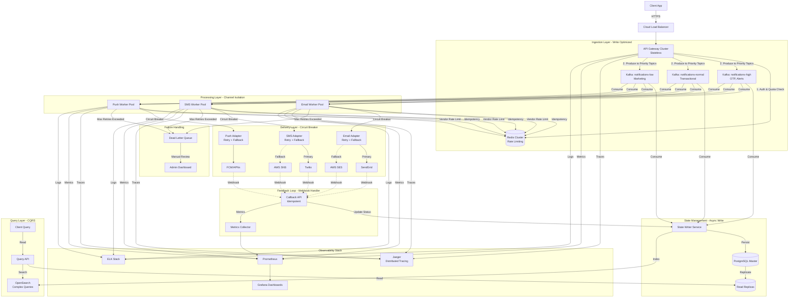

# Polyglot Notification System Design

本專案是一個高併發、多渠道通知系統的參考實作，使用不同程式語言（Java, Kotlin, Go, TypeScript, Rust）在雲端微服務架構下的最佳實踐與設計模式。

## 1. 專案挑戰與需求 (The Challenge)

本系統基於以下核心需求設計（源自 [`require.txt`](require.txt)）：

### 1.1 目標 (Objective)

設計並實作一個通知發送服務，支援多種渠道（Email, SMS, Push）並發送給終端用戶。

### 1.2 核心 API (Endpoints)

* `POST /notify`: 接收通知請求（渠道、接收者、訊息），並排入發送隊列。
* `GET /status/[notification_id]`: 查詢整體與各渠道的發送狀態。
* `GET /metrics`: 獲取聚合的統計數據（發送數、成功數、失敗數）。
* `POST /webhook/callback`: 接收外部供應商（如 SendGrid, Twilio）的回執報告。

### 1.3 關鍵約束 (Key Constraints)

1. **多渠道 (Multi-channel)**: 支援 Email, SMS, Push。需處理不同渠道的吞吐量、延遲與 Rate Limit 差異。
2. **多租戶 (Multi-tenant)**: 數據隔離，並強制執行租戶級別的配額 (Quota) 與限流 (Rate Limits)。
3. **高擴展性 (Scale)**: 需處理 **100k notifications/min** 的突發流量，並保持低延遲。
4. **高可靠性 (Reliability)**:
   * **At-least-once delivery**: 確保不丟失訊息。
   * **Retry & Backoff**: 失敗重試機制。
   * **Idempotency**: 確保重試與回調處理的冪等性。
5. **可觀測性 (Observability)**: 完整的 Tracing, Metrics 與 Alerting。
6. **可擴展性 (Extensibility)**: 插件式架構，易於新增渠道（如 Voice, In-app）。

---

## 2. 系統架構設計 (System Architecture)

本專案展示了從「可攜式參考實作」到「生產級雲原生架構」的演進。

### 2.1 目前實作架構 (Current Implementation - Portable)

為了方便演示與本地開發 (Docker Compose)，目前採用簡化架構：

* **API Gateway**: 各語言實作的 REST API (`POST /notify`)。
* **Message Queue**: 單一 Kafka Topic (`notifications`)。
* **Workers**: 通用 Worker，消費訊息並模擬發送。
* **Storage**: PostgreSQL (狀態) + Redis (限流)。

### 2.2 優化的生產級架構 (Optimized Production Architecture)

在極大規模 (100k+ notifications/min) 與多租戶場景下，採用以下優化架構：



#### 關鍵優化設計 (Key Optimizations)

##### 1. **寫入路徑優化 (Write Path Optimization)**
- **去除同步 DB 寫入**: API 層只寫 Kafka，返回 202 Accepted，避免 DB 成為瓶頸
- **專用 State Writer**: 異步消費 Kafka 並批量寫入 PostgreSQL，提升吞吐量
- **冪等性保證**: 使用 Kafka offset + Redis 去重，確保 exactly-once semantics

##### 2. **優先級隊列 (Priority Queues)**
- **High Priority**: OTP、安全警報（< 1s 延遲）
- **Normal Priority**: 交易通知、訂單確認（< 5s 延遲）
- **Low Priority**: 營銷郵件、推薦內容（< 30s 延遲）
- **獨立擴縮容**: 各優先級 Worker 可根據隊列深度獨立擴展

##### 3. **渠道隔離 (Channel Isolation)**
- **獨立 Worker Pool**: Email, SMS, Push 各自獨立部署
- **故障隔離**: 單一渠道故障不影響其他渠道
- **獨立限流**: 每個渠道有獨立的 Rate Limiter (Token Bucket)

##### 4. **熔斷與降級 (Circuit Breaker & Fallback)**
- **Circuit Breaker**: 使用 Hystrix/Resilience4j 模式，外部服務故障時自動熔斷
- **多供應商 Fallback**: Email 主用 SendGrid，故障時自動切換到 AWS SES
- **Graceful Degradation**: 熔斷時將訊息放入 DLQ，避免無限重試

##### 5. **失敗處理 (Failure Handling)**
- **Exponential Backoff**: 重試間隔指數增長 (1s, 2s, 4s, 8s, 16s)
- **Max Retry Limit**: 最多重試 5 次，超過後進入 DLQ
- **Dead Letter Queue**: 失敗訊息進入 DLQ，由人工或自動化工具處理
- **Alerting**: DLQ 深度超過閾值時觸發告警

##### 6. **讀寫分離 (CQRS Pattern)**
- **Write Model**: API → Kafka → State Writer → PostgreSQL Master
- **Read Model**: Query API → PostgreSQL Read Replicas + OpenSearch
- **最終一致性**: 狀態更新有輕微延遲 (< 100ms)，但查詢性能極高

##### 7. **完整可觀測性 (Full Observability)**
- **Distributed Tracing**: Jaeger 追蹤每個通知的完整生命週期
- **Metrics**: Prometheus 收集 QPS, Latency, Error Rate, Queue Depth
- **Dashboards**: Grafana 提供實時監控與告警
- **Logging**: ELK Stack 集中日誌，支援全文搜索與分析
- **Alerting**: 基於 Prometheus AlertManager 的多級告警

##### 8. **自動擴縮容 (Auto-scaling)**
- **HPA (Horizontal Pod Autoscaler)**: 基於 CPU/Memory/Queue Depth 自動擴縮容
- **Kafka Partition Scaling**: 根據流量動態調整 Partition 數量
- **Database Connection Pooling**: 使用 PgBouncer 管理連接池

##### 9. **安全性增強 (Security Enhancements)**
- **mTLS**: 服務間通訊使用雙向 TLS
- **Secret Management**: 使用 Vault/AWS Secrets Manager 管理敏感信息
- **API Rate Limiting**: 租戶級別的 Rate Limiting (Redis + Lua Script)
- **Webhook Signature Verification**: 驗證外部供應商的 Webhook 簽名

### 2.3 關鍵組件設計 (Component Design)

1. **API Gateway**: 無狀態服務，使用 Virtual Threads (Java) 或 Goroutines (Go) 最大化吞吐。
2. **Dispatcher Workers**: 負責 Retry (Exponential Backoff) 與 Rate Limiting (Token Bucket)。
3. **Data Store**: PostgreSQL (關聯數據) + Redis (高頻讀寫)。

---

## 3. 多語言實作與技術棧分析 (Polyglot Implementation)

本專案提供了 5 種語言的完整實作，展示各語言在雲原生場景下的優勢與解法。

### 3.1 技術棧比較矩陣

| 語言                 | 框架                       | 併發模型                           | 適用場景                                 | 專案連結                                                           |
| :------------------- | :------------------------- | :--------------------------------- | :--------------------------------------- | :----------------------------------------------------------------- |
| **Java**       | **Spring Boot 3**    | **Virtual Threads (Loom)**   | 企業級核心業務、複雜邏輯、既有 Java 團隊 | [查看 Java 實作](./notifications-polyglot/java/README.md)             |
| **Kotlin**     | **Spring Boot 3**    | **Coroutines**               | 追求開發效率與代碼簡潔性的 JVM 團隊      | [查看 Kotlin 實作](./notifications-polyglot/kotlin/README.md)         |
| **Go**         | **Gin**              | **Goroutines**               | 高吞吐量微服務、Sidecar、網關、K8s 組件  | [查看 Go 實作](./notifications-polyglot/golang/README.md)             |
| **TypeScript** | **NestJS + Fastify** | **Event Loop (Async/Await)** | 前後端統一、I/O 密集型應用、快速迭代     | [查看 TypeScript 實作](./notifications-polyglot/typescript/README.md) |
| **Rust**       | **Axum**             | **Tokio (Async)**            | 極致效能、內存安全、低延遲核心組件       | [查看 Rust 實作](./notifications-polyglot/rust/README.md)             |

### 3.2 各語言特色解法分析

#### Java (Spring Boot 3 + Virtual Threads)

* **特色**: 傳統 Java 併發依賴 OS 線程，成本高。Java 21 引入 **Virtual Threads**，讓 Thread 變得極其廉價。
* **本專案解法**: 開啟 `spring.threads.virtual.enabled=true`，讓每個請求都在虛擬線程中運行。這使得同步風格的代碼（如 JDBC）也能擁有非阻塞 I/O 的吞吐量，無需切換到複雜的 Reactive Stack (WebFlux)。

#### Kotlin (Spring Boot 3 + Coroutines)

* **特色**: **Coroutines** 提供了 "Structured Concurrency"，讓非同步代碼寫起來像同步代碼，且具備強大的 Scope 管理與異常處理。
* **本專案解法**: 使用 `suspend` 函數貫穿 Controller 到 Service。利用 `CoroutineScope` 並行處理多渠道發送，代碼比 Java 更簡潔優雅。

#### Go (Gin + Goroutines)

* **特色**: **Goroutines** 是 Go 的靈魂，啟動成本極低（KB 級別）。**Channels** 提供了安全的通訊機制。
* **本專案解法**: 使用 Worker Pool 模式，啟動固定數量的 Goroutines 消費 Kafka 訊息。利用 `select` 語句處理超時與優雅關閉 (Graceful Shutdown)。Gin 框架極致輕量，適合高效能 API。

#### TypeScript (NestJS + Fastify)

* **特色**: Node.js 的單線程事件循環 (Event Loop) 非常適合 I/O 密集型任務。
* **本專案解法**:
  * **架構**: 使用 **NestJS** 提供嚴謹的模組化架構（Controller, Service, Module），避免 JS 專案常見的結構混亂。
  * **效能**: 底層切換為 **Fastify** (取代 Express)，大幅提升 HTTP 處理效能。
  * **類型安全**: 全面使用 TypeScript DTO 與 Decorators。

#### Rust (Axum + Tokio)

* **特色**: **Zero-cost abstractions** 與 **Memory Safety** (無 GC)。
* **本專案解法**: 使用 **Axum** (基於 Tokio 的 Web 框架)。利用 Rust 的型別系統（如 `Result<T, E>`）強制處理所有錯誤情況。對於 CPU 密集型任務（如加密、序列化）或極低延遲需求，Rust 是最佳選擇。

---

## 4. 快速開始 (Quick Start)

### 前置要求

* Docker & Docker Compose
* Make (可選，用於執行 Makefile 指令)

### 啟動基礎設施

```bash
cd notifications-polyglot/infra
docker-compose up -d
# 這將啟動 Kafka, Zookeeper, PostgreSQL, Redis
```

### 運行服務

選擇您感興趣的語言目錄，執行 `make run`：

```bash
# 例如運行 Go 版本
cd notifications-polyglot/golang
make run
```

### 測試 API

```bash
curl -X POST http://localhost:8082/notify \
  -H "Content-Type: application/json" \
  -d '{
    "channels": ["email", "sms"],
    "recipient_ids": ["user123"],
    "message": "Hello Polyglot World!"
  }'
```
